<p align="center">
  <picture>
    <source media="(prefers-color-scheme: dark)" srcset="docs/images/logo-dark.png">
    
  </picture>
</p>

<h1 align="center">ZeeBoard</h1>

<p align="center">
  A desktop app to run your <b>art commissions</b>: requests, clients, characters, work stages, progress images, payments and deadlines, all in one board that lives on your computer.
</p>

<p align="center">
  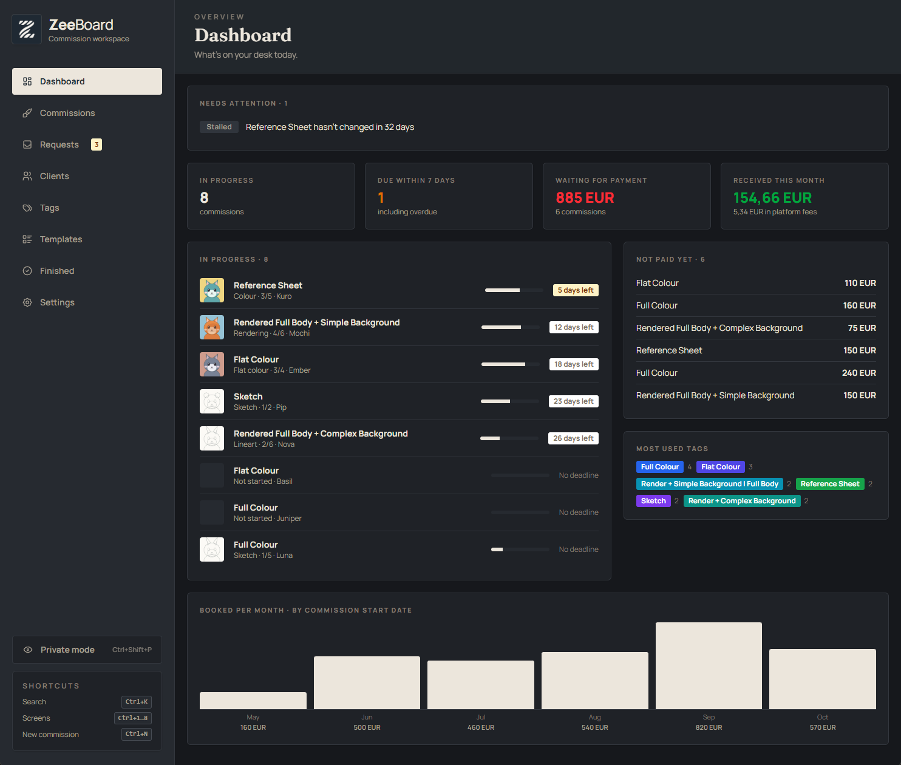
</p>

> Every screenshot in this document uses invented demo data (made-up clients, prices and artwork).

ZeeBoard is made for artists who work on commission and want every job organized without depending on a cloud service. It is **local-first**: your database and images stay on your machine, and the app only talks to the internet for one optional thing (profile photos, see [Privacy and data](#privacy-and-data)).

It works in **English and Spanish**, in light, dark or system theme, and it is built around the way a commission actually flows: someone asks, you accept, you draw it in stages, the client reviews each stage, they pay, you deliver.

## Contents

- [Install](#install)
- [A commission from start to finish](#a-commission-from-start-to-finish)
- [Dashboard](#dashboard)
- [Commissions](#commissions)
  - [Inbox, list and grid](#inbox-list-and-grid)
  - [Stages and images](#stages-and-images)
  - [Corrections and revisions](#corrections-and-revisions)
  - [Creating and editing a commission](#creating-and-editing-a-commission)
  - [Invoice description](#invoice-description)
- [Payments](#payments)
- [Requests](#requests)
- [Clients and characters](#clients-and-characters)
- [Templates](#templates)
- [Tags](#tags)
- [Finished commissions](#finished-commissions)
- [Reminders](#reminders)
- [Importing PayPal payments](#importing-paypal-payments)
- [Search and shortcuts](#search-and-shortcuts)
- [Private mode](#private-mode)
- [Settings](#settings)
  - [Backups](#backups)
  - [Exporting data](#exporting-data)
- [Themes and languages](#themes-and-languages)
- [Privacy and data](#privacy-and-data)
- [For developers](#for-developers)
- [Roadmap](#roadmap)

## Install

1. Download the installer (`ZeeBoard_x.y.z_x64-setup.exe`) and run it. The setup lets you pick English or Spanish.
2. Windows may warn that the app is unsigned. Choose **More info → Run anyway**.
3. Open **ZeeBoard** from the Start menu.

Updating is the same: run the new installer over the old one. Your data is kept (it lives outside the install folder).

Moving to another computer: on the old one use **Settings → Backups → Export**, on the new one use **Restore** and pick that folder. See [Backups](#backups).

## A commission from start to finish

1. A person fills in your form (or you add them by hand) and appears in **Requests**.
2. You **accept** them: ZeeBoard creates the client, the commission, the price and the tags for you.
3. The commission starts in the **queue** and moves through the stages of its **template** (sketch, lineart, colour, delivery…).
4. At each stage you add images, and the client's corrections are logged as revisions.
5. Payments are logged as they arrive, with the platform fee already worked out.
6. On the last stage the commission becomes **finished** and goes to the archive.

Along the way, **reminders** warn you about deadlines, stalled work and unpaid commissions, and the **dashboard** shows what needs your attention today.

## Dashboard

What is on your desk today, at a glance.


- **Needs attention**: commissions past their limit, due today or soon, stalled, or past the sketch without any payment.
- **Four counters**: commissions in progress, due within 7 days (overdue included), what is still waiting for payment, and what you received this month (with the platform fees).
- **In progress**: every open commission with its current stage, progress bar and deadline. Click one to open it.
- **Not paid yet**: what each commission still owes.
- **Most used tags** and **Received per month**, a six-month chart of the money that actually reached you (net of platform fees, by payment date).

## Commissions

### Inbox, list and grid

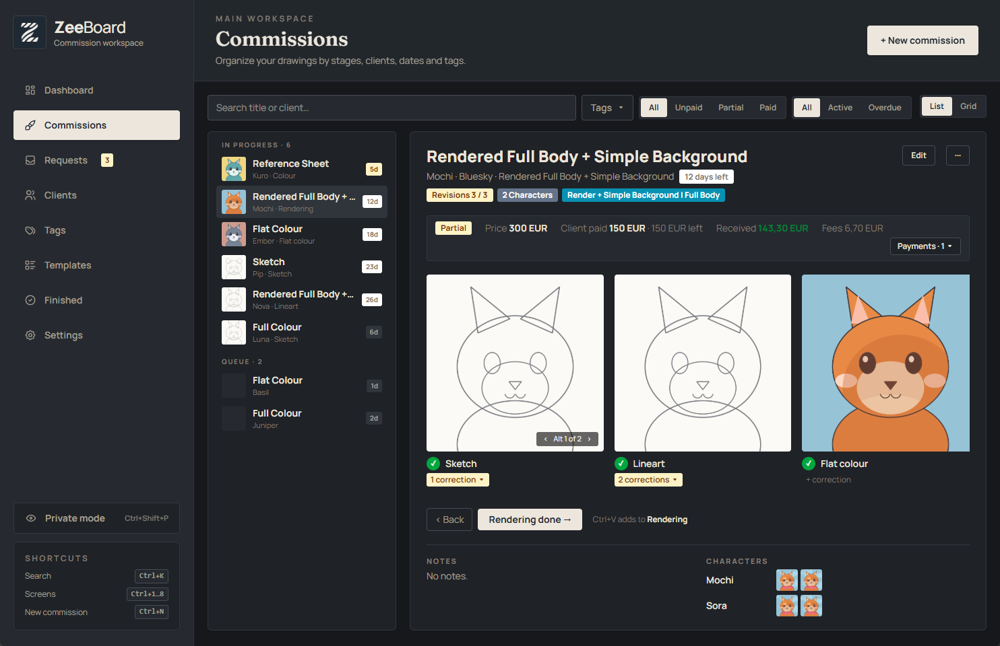

- The left column is your **inbox**: commissions already in a stage, then the **queue** of those not started. The nearest deadline comes first, and each row shows the days left (or the days since you accepted it when there is no deadline).
- On top: a **search box** (title or client), a **tags menu**, a **payment filter** (All / Unpaid / Partial / Paid) and a **status filter** (All / Active / Overdue).
- The detail shows the title, client, platform and template, the days left, a **revisions counter**, the number of characters, the tags and a button that copies the client's **tag account** (so you can paste it when you post).

**Grid view** shows every commission as a card, with a **calendar** of your deadlines and a summary of the next one.

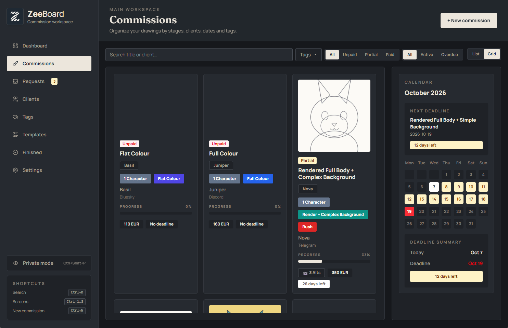

The **···** menu on a commission lets you **duplicate** it, **copy the invoice description** or **delete** it.

### Stages and images

A strip of columns, one per stage of the template, each with its own images.

- Add images by **dragging them in**, pasting with **Ctrl+V** (they go to the current stage) or clicking the empty slot. The app resizes and compresses them in the background, so even a 60 MB canvas is fine.
- Each stage can hold several versions (**alts**) with a small carousel, and you can remove any image.
- **Focus mode** opens an image full screen and lets you move through all the images of all the stages with the arrow keys.
- The **Rendering done →** button moves the commission to the next stage, and **Back** returns to the previous one.

### Corrections and revisions

Each stage has a **+ correction** button. Corrections are notes of what the client asked to change.

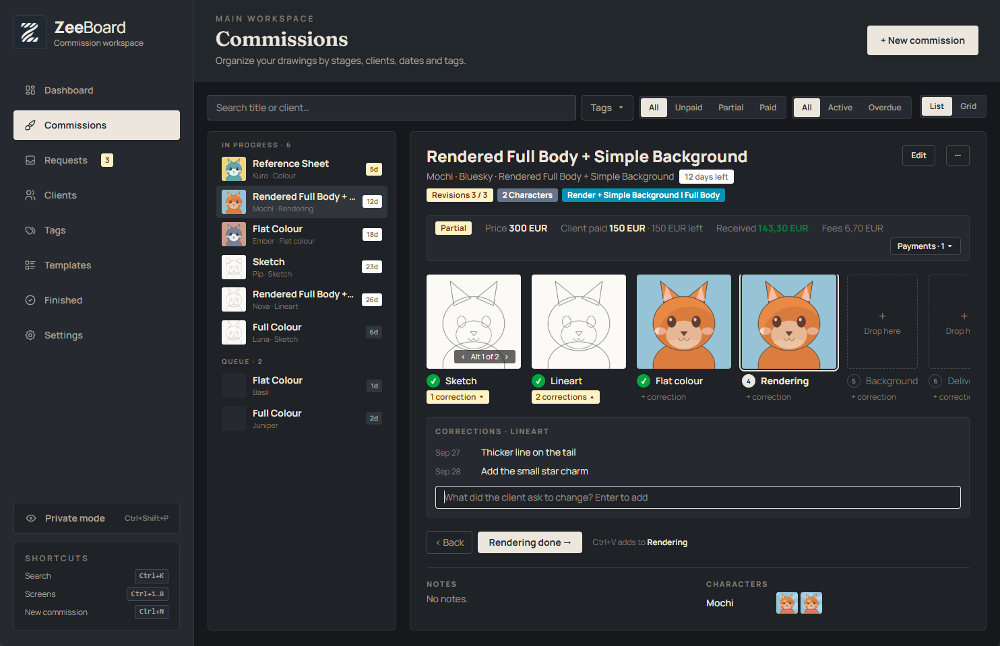

- Every correction counts as **one revision**. The header shows `Revisions used / included`, using the limit set in the template.
- The counter turns amber when you reach the limit and red (**extra**) when you go over it.
- Corrections are dated, and you can delete them.

### Creating and editing a commission

Press **Ctrl+N** or **+ New commission**.

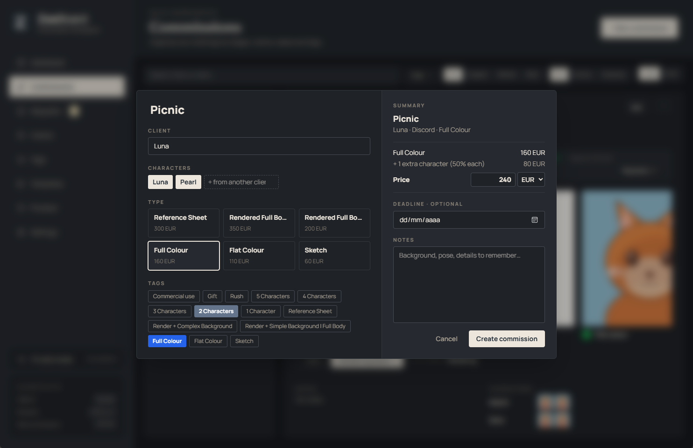

- Pick the **client** (type to search, or write a new name), the **characters** (also from other clients, for collaborations) and the **template**.
- The **price** is calculated for you: the template's base price plus a percentage per extra character (50 % by default, adjustable in Settings). You can still change it by hand.
- The matching **tags** are added automatically: the most specific commission type for the template and the "N Characters" tag. You can change them before saving.
- The template is locked once the commission exists, because its stages and images depend on it.

### Invoice description

**··· → Copy description** copies a short text for the PayPal invoice, such as `Rendered, 2 characters (Ana, Beto) - @YourHandle`, built from the template and the characters.

## Payments

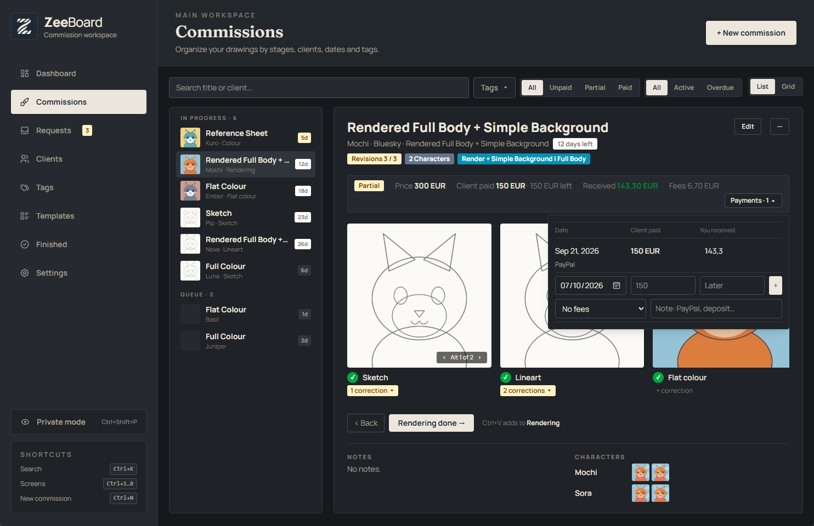

The strip above the stages is the single place for money on a commission.

- It shows the **status** (Unpaid, Partial, Paid), the **price**, what the client has **paid** and what is **left**, what you **received** and the **fees**.
- Open **Payments** to add a payment: the date, what the client paid, and what reached you. Pick a **platform** and "received" is filled with the fee already taken off (for example PayPal's 2.9 % + 0.35).
- You can leave "received" empty and enter it later, when the money arrives. Partial payments (a deposit, then the rest) are supported.
- Platforms and their fees are configured in [Settings](#settings).

## Requests

The inbox for people who want a commission.

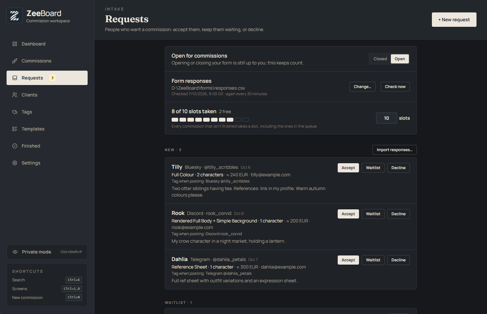

- **Open for commissions** and **slots**: you open and close your form yourself, and ZeeBoard keeps the count of how many open commissions you have against how many you accept at once. Every unfinished commission takes a slot, queue included.
- **Form responses**: ZeeBoard can read the responses of a **Google Form** from a CSV file that a small Google script keeps up to date in your Drive. It checks it when it opens and every 30 minutes, adds the new responses and shows a counter in the menu. You can also import a CSV by hand.
- Each request shows who, which platform and contact, the template, the number of characters, an **estimated price**, the email, the account to tag when posting, and their message (links are clickable).
- **Accept**, **Waitlist**, **Decline** and **Restore**. If your slots are full, accepting asks for confirmation.
- Accepting creates, in one step: the **client** (or reuses the one you already have, matched by handle or name), their email and tag account, the **commission** with its price, and the **tags**. It also tries to fetch the client's profile photo in the background.
- **+ New request** adds one by hand, and it goes through exactly the same flow.

## Clients and characters

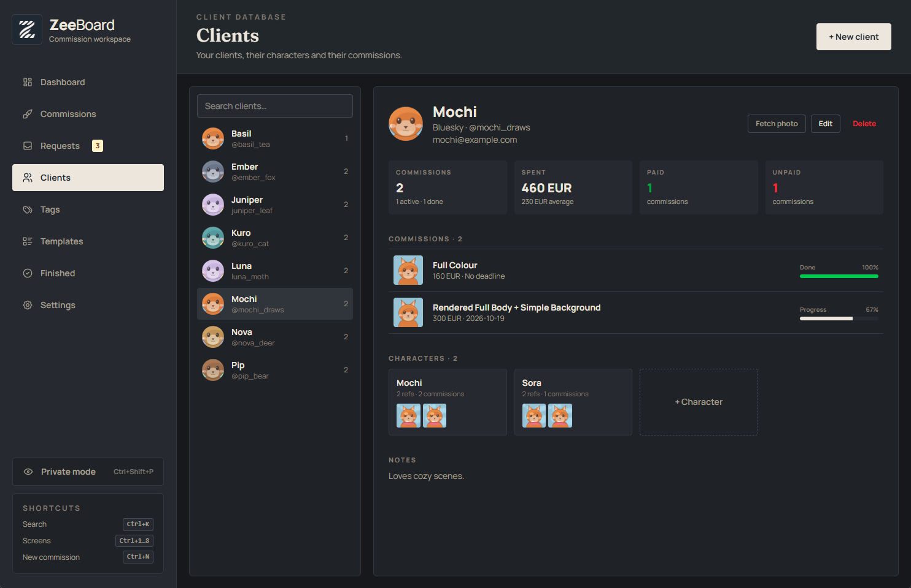

- A client has a name, platform and handle, an **email** (used to match PayPal payments), the **account to tag** when you post their work, and free notes.
- The profile shows their **commissions**, how many are active or done, how much they have **spent**, and how many are paid or unpaid.
- The **photo** can be fetched from Bluesky or Telegram (tag account first, then contact account), or set by hand by clicking the avatar, dropping an image on it or pasting with Ctrl+V. Photos are downloaded once and stored on your disk.

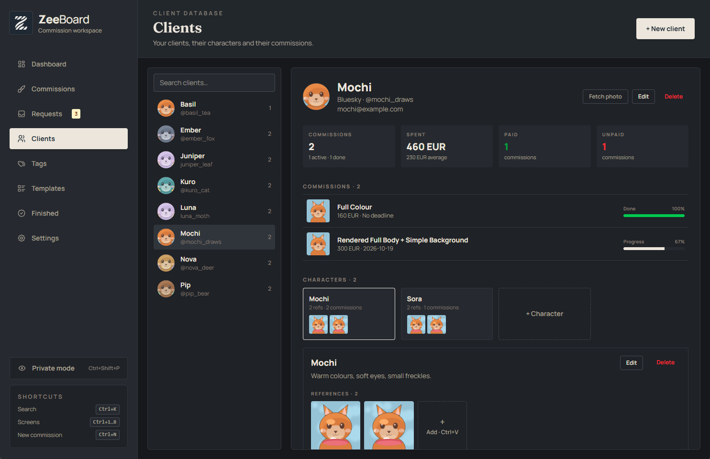

- Each client keeps their **characters**, each with notes and **reference images**. A character can be used in commissions of any client.
- Deleting a character also deletes its references and removes it from any commission.

## Templates

A template is the list of stages a kind of commission goes through.

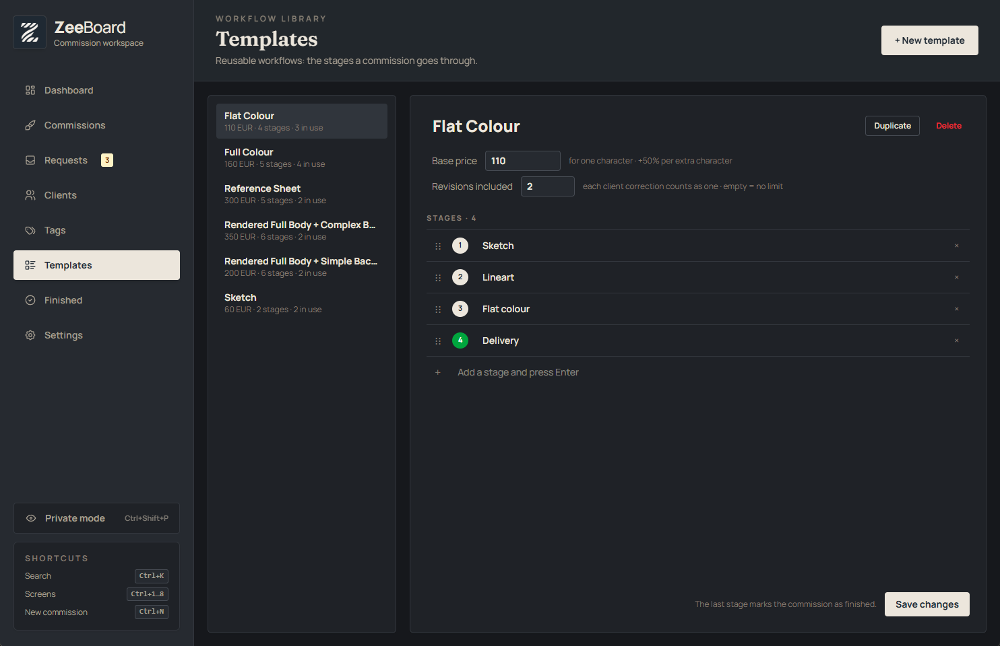

- Each template has a **base price**, a number of **revisions included**, and an ordered list of **stages** you can rename, reorder by dragging, add or remove.
- The **last stage marks the commission as finished**.
- A stage that a commission is using cannot be removed, so no commission loses its place or its images. Templates in use cannot be deleted, but you can **duplicate** them to make a variation.

## Tags

Labels grouped by **category**, with a colour each.

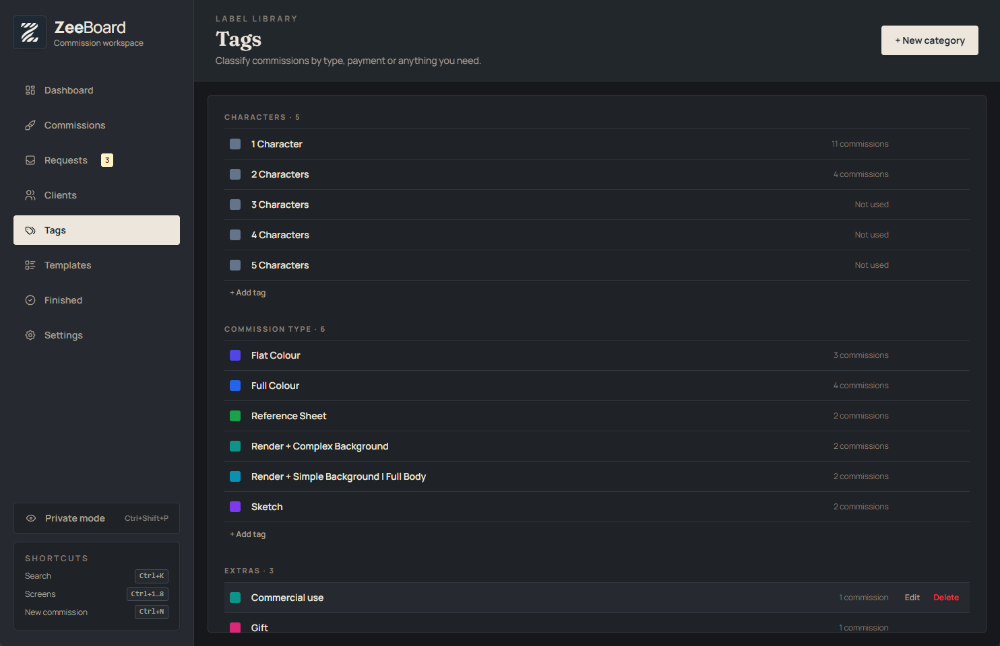

- Create categories (Commission Type, Characters, Extras… whatever you need) and tags inside them, and edit or delete them later. The list shows how many commissions use each tag.
- Tags filter the commissions list and feed the "most used tags" panel in the dashboard.

## Finished commissions

Everything you have delivered, as a register.

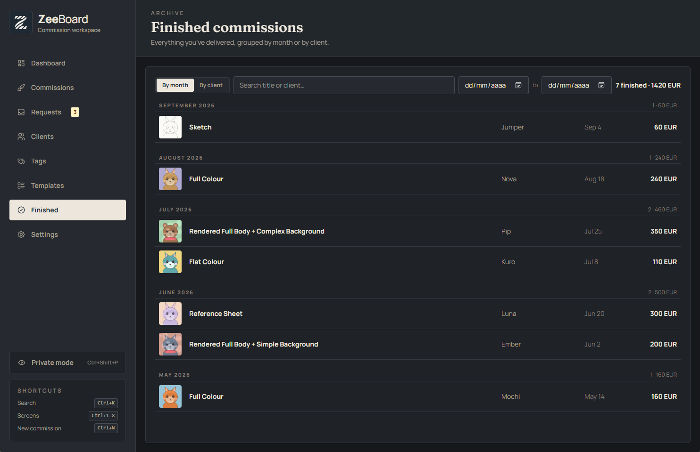

- Group by **month** or by **client**, search by title or client, and filter by **date range**.
- The header shows how many you finished and the total they add up to. Click any row to open it again.

## Reminders

ZeeBoard watches your commissions and tells you what needs attention, in the dashboard and as **Windows notifications** (each alert is shown once).

- **Delivery**: a few days before the limit and on the day. If a commission has no deadline, the limit is the day you accepted it plus the longest time you promise (60 days by default).
- **Stalled**: no new image, correction, payment or stage change for a number of days (21 by default).
- **Unpaid**: the commission left the first stage of its template (your sketch was approved) and nothing has been paid yet.

Alerts are checked when the app opens and every 30 minutes while it stays open. All the numbers are in [Settings](#settings).

## Importing PayPal payments

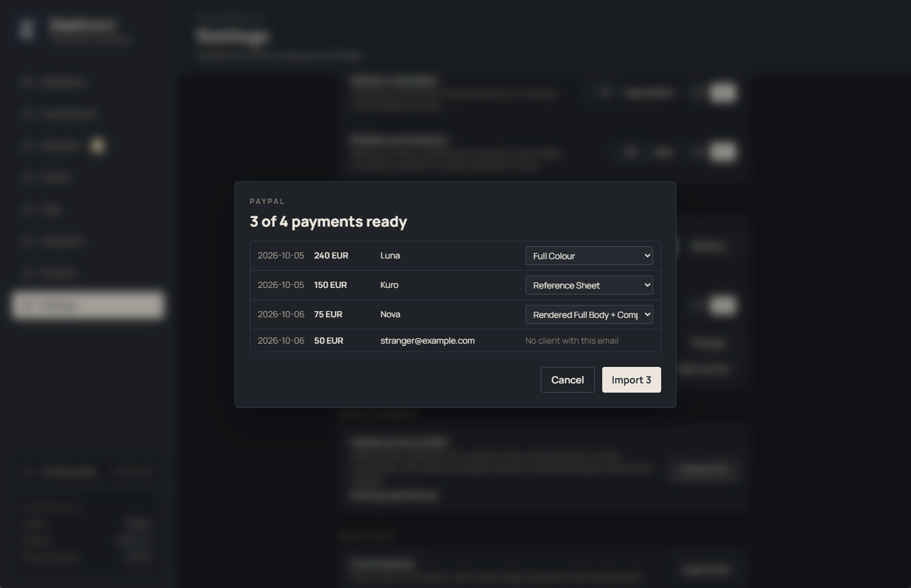

Download your **activity CSV** from PayPal (English or Spanish headers) and choose it in **Settings → Import payments**.

- Each incoming payment is matched with a **client by their email**, and with that client's commission that still has a **balance in the same currency**: first the one that owes exactly that amount, otherwise the oldest.
- You see a **preview** and can change the commission of each payment before importing. Payments without a matching client, refunds and pending ones are skipped.
- Each payment is saved with what the client paid, **what you actually received** (PayPal's net) and its date. The transaction id is stored, so **importing the same file twice never duplicates** anything.
- Settings tells you the date of your last imported payment and from which day to download the next file (two days earlier, so nothing is missed).

## Search and shortcuts

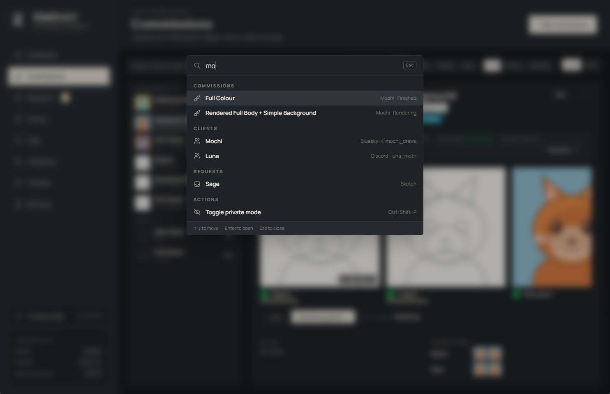

Press **Ctrl+K** anywhere to search commissions (title, client, stage), clients (name, handle, email), requests and screens, and to run **actions**: new commission, new client, toggle private mode, switch language, switch theme, back up now, show the shortcuts. Accents and capital letters are ignored, and every word you type must match.

| Shortcut | What it does |
|---|---|
| `Ctrl+K` | Search and actions |
| `Ctrl+1` … `Ctrl+8` | Go to a screen, in menu order |
| `Ctrl+N` | New commission |
| `Ctrl+Shift+P` | Toggle private mode |
| `Ctrl+V` | Paste an image into the current stage (or the open character) |
| `?` | Show the list of shortcuts |
| `Esc` | Close the panel or dialog |

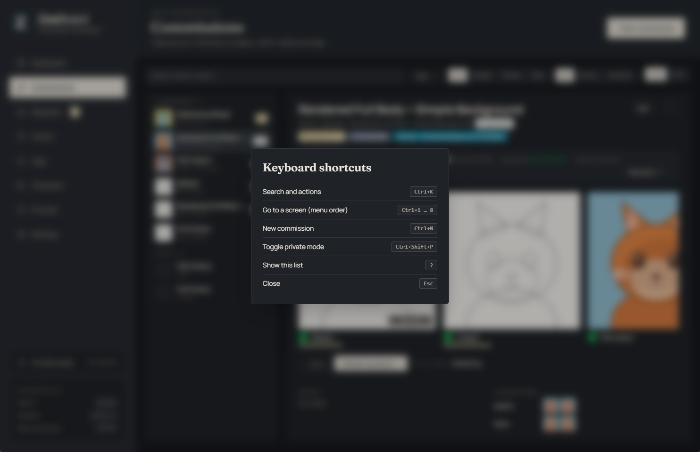

## Private mode

For streaming or screen sharing. **Ctrl+Shift+P** (or the button in the menu) hides **client names and prices** everywhere, and blurs the text fields that can hold them. The setting is remembered, so if you restart the app mid-stream it stays hidden. Exports always contain the real data.

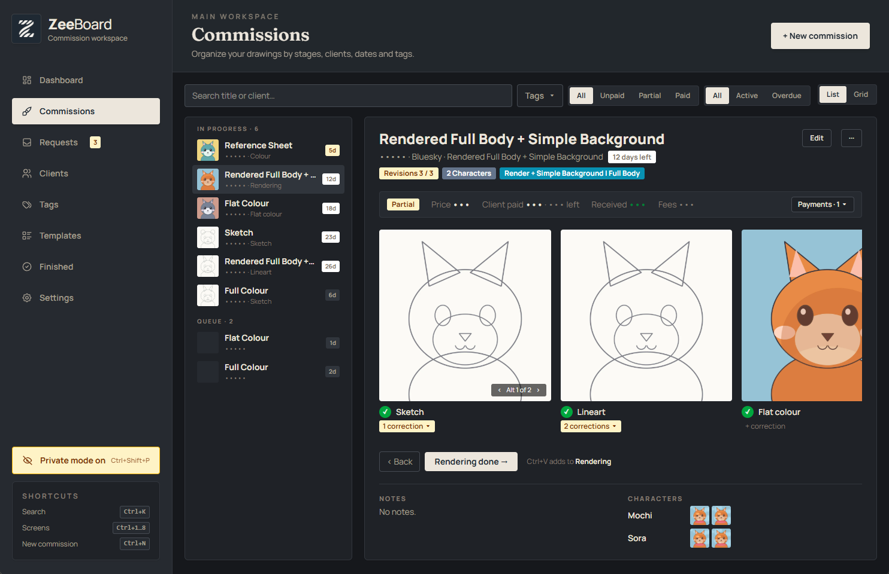

## Settings

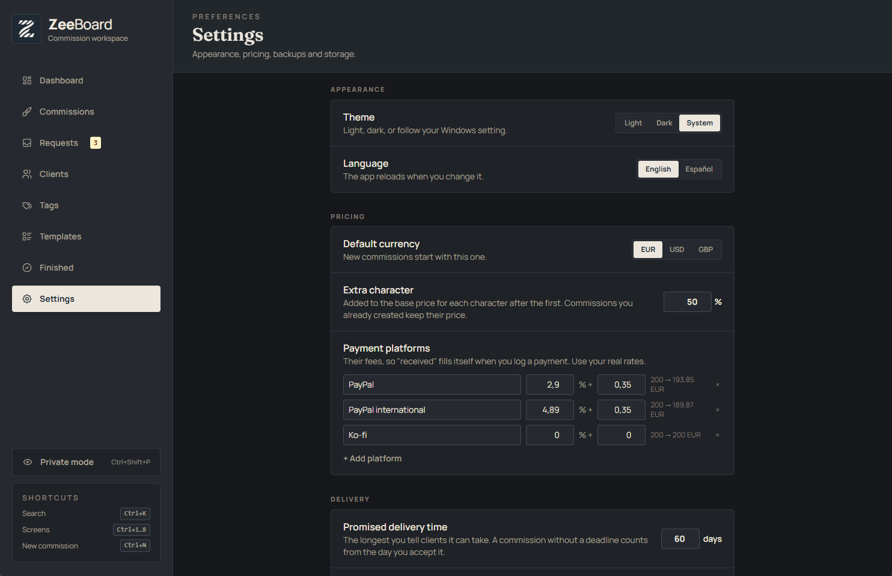

- **Appearance**: theme and language.
- **Pricing**: default currency (EUR, USD or GBP), the extra-character percentage, and your **payment platforms** with their fixed and percentage fees, with a live example (`200 → 193.85`).
- **Delivery**: the longest time you promise, delivery reminders and stalled alerts, each with its own number of days and an on/off switch.

### Backups

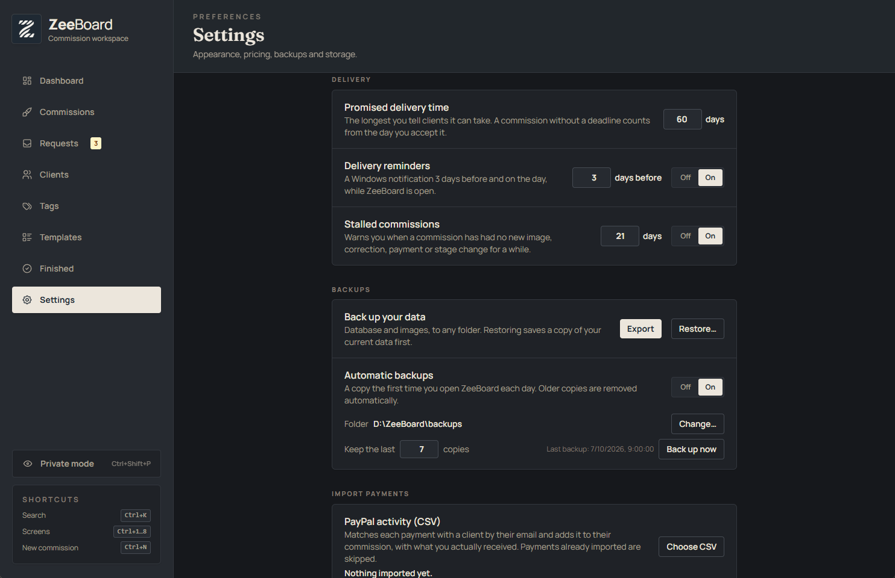

- **Export** saves the database and all images into a dated folder, wherever you choose.
- **Restore** replaces your data with a backup. First it keeps a **safety copy of your current data**, and it never deletes images. The app reloads when it finishes.
- **Automatic backups**: one copy the first time you open ZeeBoard each day, in the folder you choose, keeping only the last N (7 by default). Pointing it at a synced folder (Google Drive, Dropbox…) gives you off-site backups for free.
- **Unused images → Clean up** deletes image files that no commission or character uses any more, after making a full backup first.

### Exporting data

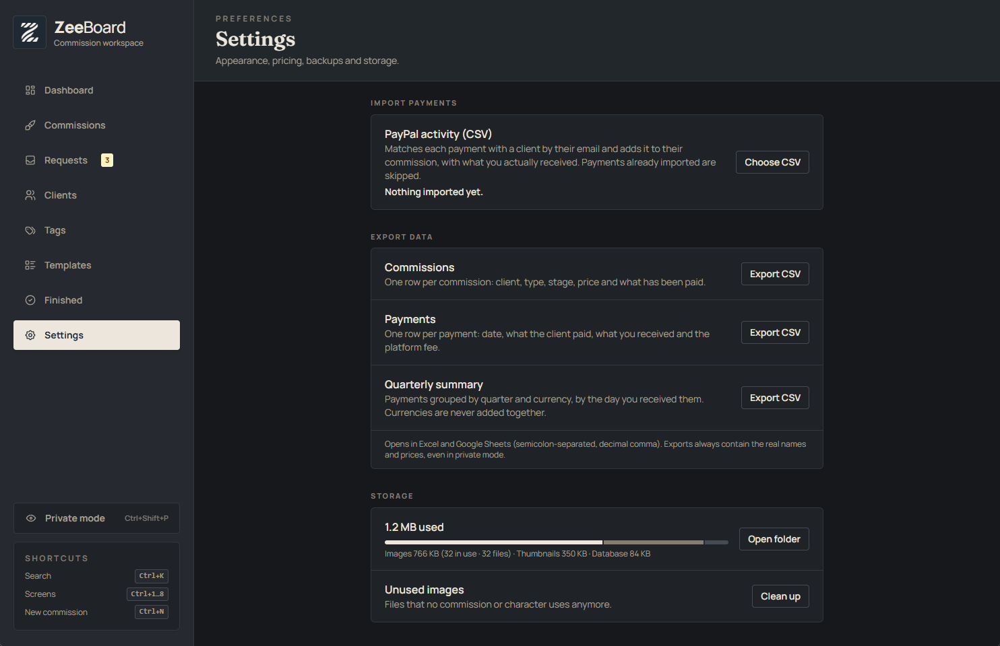

Three CSV exports: **Commissions** (one row each), **Payments** (date, paid, received and fee) and a **Quarterly summary** by quarter and currency (currencies are never added together). They use a semicolon and a decimal comma and include a BOM, so **Excel opens them correctly** in Spanish and English locales. The **Storage** card shows how much space the images, thumbnails and database use.

## Themes and languages

Light, dark, or follow your system:

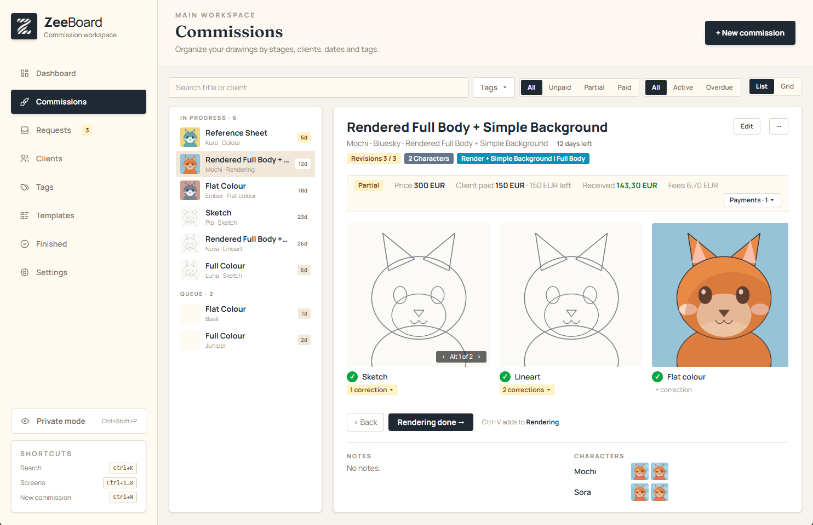

The whole app is also available in **Spanish**. Switching the language reloads the app and keeps you on the same screen. Names, notes and anything you type stay as you wrote them.

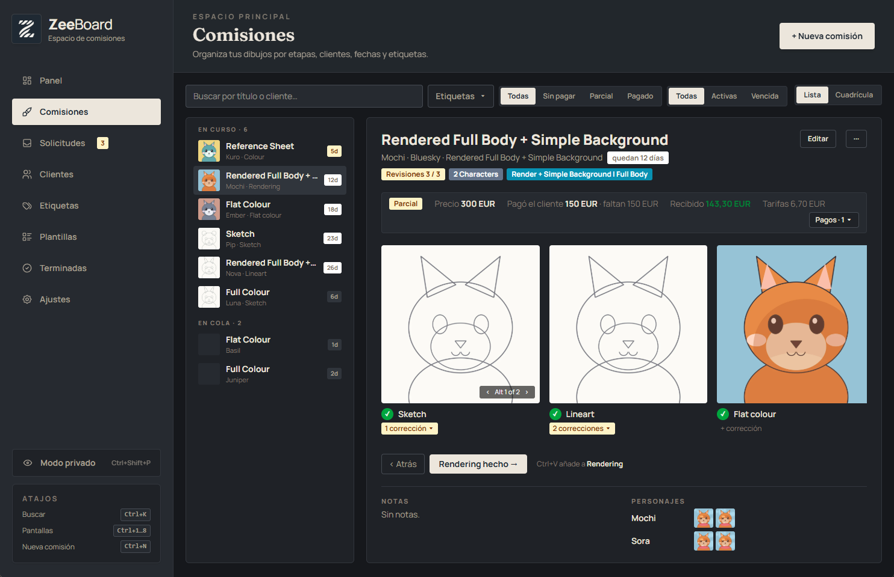

## Privacy and data

- **Everything is stored locally** in `%APPDATA%\com.zeeboard.app\`: `zeeboard.db` (SQLite) and an `images/` folder. Uninstalling does not delete it unless you ask.
- **Images** are processed on your machine: a lightweight WebP copy for viewing and a thumbnail. Your originals are never touched.
- **The only network access** is the optional *Fetch photo* feature. It runs in the app's Rust side with a **closed list of servers** (Bluesky and Telegram), only over `https`, with time and size limits. Nothing else is sent anywhere.
- The Google Form connection reads a **local CSV file** (kept up to date by your own Drive for desktop); ZeeBoard never logs in to Google.
- There are no accounts, analytics or telemetry.

## For developers

Requirements: [Node.js](https://nodejs.org), [Rust](https://www.rust-lang.org/tools/install) and the [Tauri prerequisites for Windows](https://tauri.app/start/prerequisites/).

```bash
npm install
npm run tauri dev      # development
npm run tauri build    # builds the installer in src-tauri/target/release/bundle/nsis
```

Quick checks of the business logic (no framework, each prints "ok"):

```bash
npx tsx scripts/check-payments.ts   # also: check-reminders, check-export, check-form-import,
                                    # check-avatars, check-paypal, check-search, check-i18n
cd src-tauri && cargo test
```

| Part | Technology |
|---|---|
| Desktop shell | [Tauri 2](https://tauri.app) (Rust) |
| Interface | React 19 + TypeScript + Vite |
| Styles | Tailwind CSS 4 |
| Data | SQLite through `tauri-plugin-sql` |
| Images | Processed in Rust (WebP + thumbnails) |
| Icons and type | Tabler Icons, Fraunces and Manrope, bundled with the app |

```
src/
├── App.tsx              menu, shortcuts and navigation
├── pages/               one file per screen
├── components/          shared pieces (search palette, payments, filters…)
└── lib/                 database, images, backups, imports, reminders, i18n…
src-tauri/               Rust side, icons and configuration
scripts/                 quick logic checks
docs/images/             the screenshots in this README
```

Text in the interface is written in English and translated through a dictionary (`src/lib/es.ts`); `scripts/check-i18n.ts` verifies that every text has its translation.

## Roadmap

What has been done and what could come next lives in [ROADMAP.md](ROADMAP.md).
